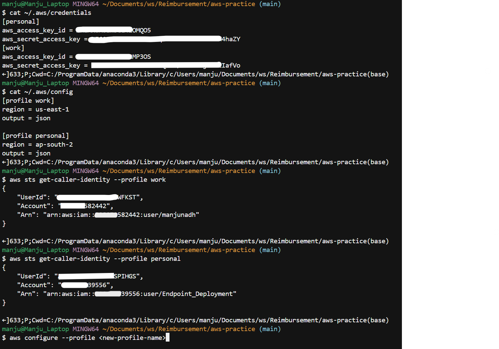

## AWS General Notes

## Set up a profile per account

```bash
aws configure --profile personal
# AWS Access Key ID: <personal key>
# AWS Secret Access Key: <personal secret>
# Default region: ap-south-2 (or whatever that account uses)
# Default output: json

aws configure --profile work
# ... work account's keys ...
```

For each project, based on which profile is needed, use `export AWS_PROFILE=work` to set the profile for that terminal session.



#### Note:

- For multiple AWS accounts(work and personal for example), create profiles in `~/.aws/credentials` and `~/.aws/config` as shown in image. In the bash terminal, just export whichever aws profile is necessary using `export AWS_PROFILE=<your-profile>` and the corresponding credentials are used.
- `UserId` in aws sts get-caller-identity is AWS internal id for each AWS User, and the credentials for this id are madeup of 2 parts(aws_access_key_id, aws_secret_access_key)
- IAM (Identity and Access Management) is the central service used to securely control access to AWS resources
- **IAM user**: an identity for one person or program inside the account
  - Example: `arn:aws:iam::<aws-account-number>:user/Endpoint_Deployment`
  - `Endpoint_Deployment` is the IAM username, and we can attach AWS policies(AmazonS3ReadOnlyAccess, AmazonS3ObjectLambdaExecutionRolePolicy etc.) to it.
- **Credentials**: what a user shows to prove who they are. There are two kinds:
  - A **console password** is used to sign in on the AWS website.
  - **Access keys** are used by the CLI or code:
    - **aws_access_key_id**: public part of accesskeys
    - **aws_secret_access_key**: private part of accesskeys
- **Policy**: a rule that says what is allowed.
  - Example: AmazonS3ReadOnlyAccess, AmazonS3ObjectLambdaExecutionRolePolicy
- **Group**: Collection of users that share the same policy.
  - Example: put all interns in an Interns group that can only read S3.
- **Role**: Set of permissions that someone borrows for a short time. A role has no password or permanent keys.
  - Example: `arn:aws:iam::<aws-account-number>:role/lambda-service-role`
  - `lambda-service-role` is the role that has permissions for multiple policies like `AWSLambdaBasicExecutionRole`, `AmazonS3FullAccess` etc.
- **Amazon Resource Name (ARN)**: Unique string that identifies an AWS resource
  - Example: arn:aws:iam:::/
    - IAM-resource-type   ==> user/role/group
    - IAM-resource-name ==> username/Rolename/Groupname
- **JSON Policy Document**: JSON file that holds an IAM policy. The following are the keys in this json:

  | Field                | Meaning                                               | Example                                                         |
  | -------------------- | ----------------------------------------------------- | --------------------------------------------------------------- |
  | Version              | The policy language version. Always use "2012-10-17". | "2012-10-17"                                                    |
  | Statement            | A list of one or more rules                           | [ {...}, {...} ]                                                |
  | Effect               | Allow or Deny                                         | "Allow"                                                         |
  | Action               | What can be done, written as service:operation        | "s3:GetObject" (read a file), "s3:DeleteObject" (delete a file) |
  | Resource             | Which things the rule applies to, given as ARNs       | "arn:aws:s3:::my-bucket/*" (every file in that bucket)          |
  | Condition (optional) | Extra requirements for the rule to apply              | Only from a certain IP address, or only with MFA                |

  Example JSON Policy Document:
  ```json
  {
  "Version": "2012-10-17",
  "Statement": [
    {
      "Effect": "Allow",
      "Action": ["s3:GetObject", "s3:ListBucket"],
      "Resource": [
        "arn:aws:s3:::my-bucket",
        "arn:aws:s3:::my-bucket/*"
      ]
    }
  ]
  }
  ```

